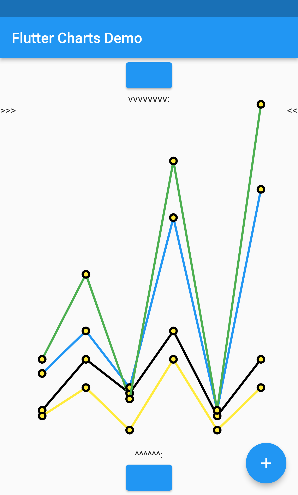

# Table of Contents

1.  [Latest release changes](#org18fb04c)
    1.  [Illustration of a new feature: ability to hide labels, legend, or gridlines](#org986c654)
2.  [Installation](#org84d029d)
    1.  [Installing flutter\_charts as a library package into your app](#org1d59e7c)
    2.  [Installing the flutter\_charts project as a local clone from Github](#orgc438bce)
3.  [Running the examples included in flutter\_charts](#orgf6f8656)
4.  [Examples with code: LineChart and VerticalBarChart. Code and resulting charts](#org2c5c2fc)
    1.  [New examples](#org80a17c8)
        1.  [Heading ex10RandomData\_lineChart ](#ex10RandomData_lineChart)
    2.  [Example with Random Data (Y values), Random X Labels, Random Colors, Random Data Rows Legends, Data-Generated Y Labels.](#org2ff7571)
    3.  [User-Provided Data (Y values), User-Provided X Labels, Random Colors, User-Provided Data Rows Legends, Data-Generated Y Labels,](#org7b81a58)
    4.  [User-Provided Data (Y values), User-Provided X Labels, Random Colors, User-Provided Data Rows Legends, User-Provided Y Labels](#orgbca6764)
    5.  [VerticalBar Chart - one more example, showing positive/negative stacks:](#org6302ddc)
        1.  [User-Provided Data (Y values), User-Provided X Labels, User-Provided Colors, User-Provided Data Rows Legends, User-Provided Y Labels](#org01a95d4)
5.  [Illustration of the "iterative auto layout" feature](#org370aeeb)
    1.  [Autolayout step 1](#org30e5c30)
    2.  [Autolayout step 2](#org120b35b)
    3.  [Autolayout step 3](#orgfdcbeba)
    4.  [Autolayout step 4](#org7aa3b91)
    5.  [Autolayout step 5](#orge402ec9)
6.  [Known packages, libraries and apps that use this flutter\_charts package](#org9b60551)
7.  [Todos](#org35fff2f)

# Latest release changes

The latest release is 0.3.0

The <CHANGELOG.md> document describes features and bug fixes in this and older versions.

## Illustration of a new feature: ability to hide labels, legend, or gridlines

Code is for the line chart. See the function `Widget createRequestedChart()` in <https://github.com/mzimmerm/flutter_charts/blob/master/example1/lib/main.dart> for changes to create a vertical bar chart instead (essentially in this code substitute "Line" for "VerticalBar". For the configuration, the section of interest is around `ExamplesEnum.ex31AnimalsBySeasonNoLabelsShown`

    // This is how noLabels can be set. See the previous section for a fine control of this option
    ChartOptions  chartOptions = LineChartOptions.noLabels(); 
    ChartData  chartData = ChartData();
    chartData.dataRowsLegends = [
      'Spring',
      'Summer',
      'Fall',
      'Winter',
    ];
    chartData.dataRows = [
      [10.0, 20.0, 5.0, 30.0, 5.0, 20.0],
      [30.0, 60.0, 16.0, 100.0, 12.0, 120.0],
      [25.0, 40.0, 20.0, 80.0, 12.0, 90.0],
      [12.0, 30.0, 18.0, 40.0, 10.0, 30.0],
    ];
    chartData.xLabels = ['Wolf', 'Deer', 'Owl', 'Mouse', 'Hawk', 'Vole'];
    chartData.assignDataRowsDefaultColors();
    
    // This section is shown repeatedly in all examples, to stress how charts are created
    LineChartTopContainer lineChartContainer = LineChartTopContainer(
      chartData: chartData,
      chartOptions: chartOptions,
      xContainerLabelLayoutStrategy: xContainerLabelLayoutStrategy,
    );
    
    LineChart lineChart = LineChart(
      painter: LineChartPainter(
        lineChartContainer: lineChartContainer,
      ),
    );

The `lineChart` widget can be placed on any Flutter app. The example code is in <https://github.com/mzimmerm/flutter_charts/blob/master/example1/lib/main.dart>

Result line chart:

Result vertical bar chart:

# Installation

## Installing flutter\_charts as a library package into your app

If you want to use the `flutter_charts` library package in your app, please follow instructions in <https://pub.dev/packages/flutter_charts/install>. This will result in ability of your app to use  `flutter_charts`.

## Installing the flutter\_charts project as a local clone from Github

The advantage of installing the source of the `flutter_charts` project locally from Github is that you can run the packaged example application and also run the integration and widget tests.

To install (clone) the `flutter_charts` project from Github to your local system, follow these steps:

-   Install Flutter, and items such as Android emulator. Instructions are on the Flutter website <https://docs.flutter.dev/get-started/install>.
-   Go to <https://github.com/mzimmerm/flutter_charts>, click on the "Code" button, and follow the instuctions to checkout flutter\_charts. A summary of one installation method (download method):
-   Click the "Download zip" link <https://github.com/mzimmerm/flutter_charts/archive/refs/heads/master.zip>
-   When prompted, save the file `flutter_charts-master.zip` one level above where you want the project. We will use `$HOME/dev`
-   Unzip the file `flutter_charts-master.zip`
-   The project will be in the `$HOME/dev/flutter_charts-master/` directory

# Running the examples included in flutter\_charts

This section assumes you installed the flutter\_charts project as a local clone from Github, as described in [3](#orgf6f8656)

There is an example application in flutter\_charts: `example1/lib/main.dart`. It shows how the Flutter Charts library can be included in a Flutter application.

To run the example application, Android emulator or iOS emulator need to be installed. You can use an IDE or command line. Instructions here are for the command line. Start in the unzipped directory, and follow the steps below:

-   Important: Make sure an Android or iOS emulator is running, or you have a physical device connected. See the [2.2](#orgc438bce) section.
-   `cd $HOME/dev/flutter_charts-master/`
-   Paste any of the lines below to the command line.
    -   To run one example (actually two, first line chart, next vertical bar chart), run:
        
            tool/demo/run_all_examples.sh ex10RandomData
        
        (press q in the terminal to quit the current example and run next)
    -   To run all examples 
        
            tool/demo/run_all_examples.sh
        
        (press q in the terminal to quit the current example and run next)

Sample screenshot from the running example app

# Examples with code: LineChart and VerticalBarChart. Code and resulting charts

Flutter Charts code allow to define the following data elements:

<table border="2" cellspacing="0" cellpadding="6" rules="groups" frame="hsides">

<colgroup>
<col  class="org-left" />

<col  class="org-left" />
</colgroup>
<tbody>
<tr>
<td class="org-left"><i>Data (Y values)</i></td>
<td class="org-left">User-Provided or Random</td>
</tr>

<tr>
<td class="org-left"><i>X Labels</i></td>
<td class="org-left">User-Provided or Random</td>
</tr>

<tr>
<td class="org-left"><i>Options including Colors</i></td>
<td class="org-left">User-Provided or Random</td>
</tr>

<tr>
<td class="org-left"><i>Data Rows Legends</i></td>
<td class="org-left">User-Provided or Random</td>
</tr>

<tr>
<td class="org-left"><i>Y Labels</i></td>
<td class="org-left">User-Provided or Data-Generated</td>
</tr>
</tbody>
</table>

The examples below show a few alternative code snippets (User-Provided or Random data, labels, option) and the resulting charts.

See the section [3](#orgf6f8656) on how to run the code that created the images below.  The code snippets are from the method `Widget createRequestedChart()` in `example1/lib/main.dart` 

## IN-PROGRESS New examples

Internal note: convert all images to width=150

    for file in doc/readme_images/ex*; do
        copy_name="$(basename $file)"
        copy_name="${copy_name/%.*/}"
        convert  $file -resize 150 $(dirname $file)/${copy_name}_w150.png
    done

<table border="2" cellspacing="0" cellpadding="6" rules="groups" frame="hsides">

<colgroup>
<col  class="org-left" />

<col  class="org-left" />
</colgroup>
<tbody>
<tr>
<td class="org-left">&#xa0;</td>
<td class="org-left">&#xa0;</td>
</tr>
</tbody>
</table>

[ [ Heading ex10RandomData\_lineChart][ ] ] Heading link does not work

### Heading ex10RandomData\_lineChart 

## Example with Random Data (Y values), Random X Labels, Random Colors, Random Data Rows Legends, Data-Generated Y Labels.

This example shows that Data-Generated Y labels are default. Flutter Charts support reasonably intelligently generated Y Labels from data, including dealing with negatives.

Code is for line chart. See the function `Widget createRequestedChart()` in <https://github.com/mzimmerm/flutter_charts/blob/master/example1/lib/main.dart> for changes to create a vertical bar chart instead (essentially in this code substitute "Line" for "VerticalBar".

    ChartOptions chartOptions = LineChartOptions();  
    ChartData chartData = RandomChartData();
    
    // This section is shown repeatedly in all examples, to stress how charts are created
    LineChartTopContainer lineChartContainer = LineChartTopContainer(
      chartData: chartData,
      chartOptions: chartOptions,
      xContainerLabelLayoutStrategy: xContainerLabelLayoutStrategy,
    );
    
    LineChart lineChart = LineChart(
      painter: LineChartPainter(
        lineChartContainer: lineChartContainer,
      ),
    );

The `lineChart` widget can be placed on any Flutter app. The example code is in <https://github.com/mzimmerm/flutter_charts/blob/master/example1/lib/main.dart>

Result line chart:

Result vertical bar chart:

## User-Provided Data (Y values), User-Provided X Labels, Random Colors, User-Provided Data Rows Legends, Data-Generated Y Labels,

Code is for line chart. See the function `Widget createRequestedChart()` in <https://github.com/mzimmerm/flutter_charts/blob/master/example1/lib/main.dart> for changes to create a vertical bar chart instead (essentially in this code substitute "Line" for "VerticalBar". Section `ExamplesEnum.ex30AnimalsBySeasonWithLabelLayoutStrategy_lineChart.png`

    ChartOptions chartOptions = LineChartOptions();  
    LabelLayoutStrategy xContainerLabelLayoutStrategy = DefaultIterativeLabelLayoutStrategy(
      options: chartOptions,
    );
    ChartData  chartData = ChartData();
    chartData.dataRowsLegends = [
      'Spring',
      'Summer',
      'Fall',
      'Winter',
    ];
    chartData.dataRows = [
      [10.0, 20.0, 5.0, 30.0, 5.0, 20.0],
      [30.0, 60.0, 16.0, 100.0, 12.0, 120.0],
      [25.0, 40.0, 20.0, 80.0, 12.0, 90.0],
      [12.0, 30.0, 18.0, 40.0, 10.0, 30.0],
    ];
    chartData.xLabels = ['Wolf', 'Deer', 'Owl', 'Mouse', 'Hawk', 'Vole'];
    chartData.assignDataRowsDefaultColors();
    
    // This section is shown repeatedly in all examples, to stress how charts are created
    LineChartTopContainer lineChartContainer = LineChartTopContainer(
      chartData: chartData,
      chartOptions: chartOptions,
      xContainerLabelLayoutStrategy: xContainerLabelLayoutStrategy,
    );
    
    LineChart lineChart = LineChart(
      painter: LineChartPainter(
        lineChartContainer: lineChartContainer,
      ),
    );

The `lineChart` widget can be placed on any Flutter app. The example code is in <https://github.com/mzimmerm/flutter_charts/blob/master/example1/lib/main.dart>

Result line chart:

Result vertical bar chart:

## User-Provided Data (Y values), User-Provided X Labels, Random Colors, User-Provided Data Rows Legends, User-Provided Y Labels

This example show how to use the option `useUserProvidedYLabels`, and scaling of data to the Y labels range.

For code, please refer to the function `Widget createRequestedChart()` in <https://github.com/mzimmerm/flutter_charts/blob/master/example1/lib/main.dart>, section `ExamplesEnum.ex40LanguagesWithYOrdinalUserLabelsAndUserColors`

## VerticalBar Chart - one more example, showing positive/negative stacks:

### User-Provided Data (Y values), User-Provided X Labels, User-Provided Colors, User-Provided Data Rows Legends, User-Provided Y Labels

This example has again user defined Y Labels, with a bar chart, using the smart auto-layout of user defined Y Labels. The chart shows negative and positive values similar to %down/%up stock charts.

For code, please refer to the function `Widget createRequestedChart()` in <https://github.com/mzimmerm/flutter_charts/blob/master/example1/lib/main.dart>, section `ExamplesEnum.ex50StocksWithNegativesWithUserColors`

(there is a bug here,see Known Bugs)

# Illustration of the "iterative auto layout" feature

This section illustrates how the auto layout behaves when less and less horizontal space is available to display the chart. 

Flutter chart library automatically checks for the X label overlap, and follows with rule-based iterative re-layout, to prevent labels running into each other.

To illustrate "stressed" horizontal space for the chart, we are gradually adding a text widget containing and increasing number of '<' characters on the right of the chart.

## Autolayout step 1

Let's say there are six labels on a chart, and there is sufficient space to display labels horizontally. The result may look like this:
We can see all x axis labels displayed it full, horizontally oriented.

## Autolayout step 2

Next, let us make less available space by taking away some space on the right with a wider text label such as '<<<<<<'
We can see the labels were automatically tilted by the angle `LabelLayoutStrategy.labelTiltRadians` for the labels to fit.

## Autolayout step 3

Next, let us make even less available space by taking away some space on the right with a wider text label such as '<<<<<<<<<<<'.
We can see that labels are not only tilted, but also automatically skipped for labels not to overlap (every 2nd label is skipped, see option `ChartOptions.iterativeLayoutOptions.showEveryNthLabel`).

## Autolayout step 4

Next, let us make even less available space some more compared to step 3, with even a wider text label such as '<<<<<<<<<<<<<<<<<<<<<<<<<<<<<<'.
We can see even more labels were skipped for labels to prevent overlap, the chart is showing every 5th label.

## Autolayout step 5

Last, let us take away extreme amount of horizontal space by using '<<<<<<<<<<<<<<<<<<<<<<<<<<<<<<<<<<<<<<<<<<',
Here we can see the "default auto layout" finally gave up, and overlaps labels. Also, the legend is now hidded, as the amount of horizontal space is not sufficient.

# Known packages, libraries and apps that use this flutter\_charts package

1.  Michael R. Fairhurst's **Language reader app** - see <https://github.com/MichaelRFairhurst/flutter-language-reader-app>

# TODO Todos

1.  [X] During construction of DataRows, enforce default values of Legend names and colors for rows. This fixes issues such as <https://github.com/mzimmerm/flutter_charts/issues/18>, when users do not set them and expect (reasonably) a default chart to show anyway.
2.  [ ] Replace \`reduce(fn)\` with \`fold(initialValue, fn)\` throughout code to deal with exceptions when lists are empty.
3.  [X] Allow scaling y values using a function.

