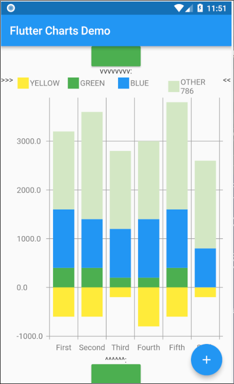
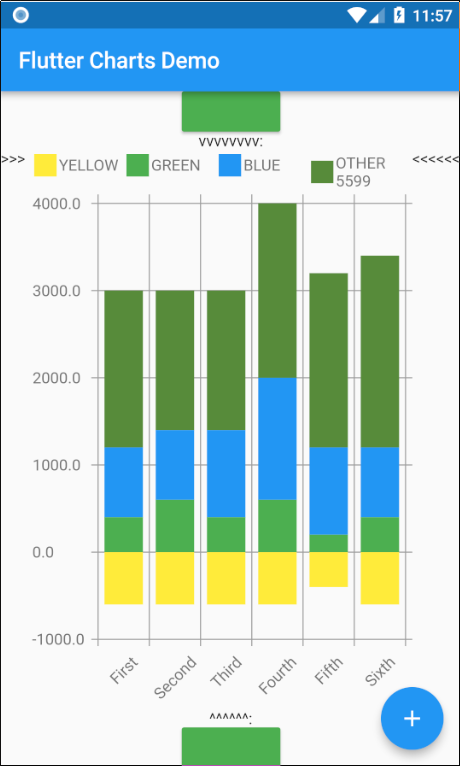
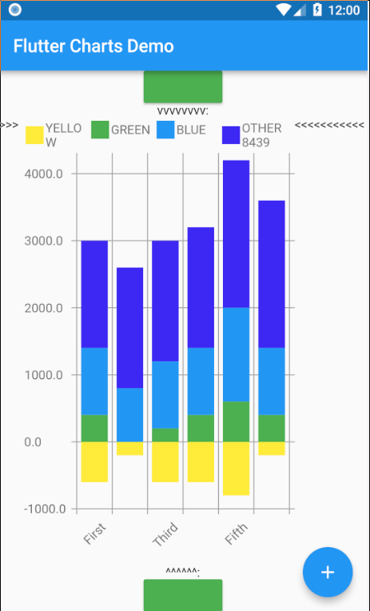
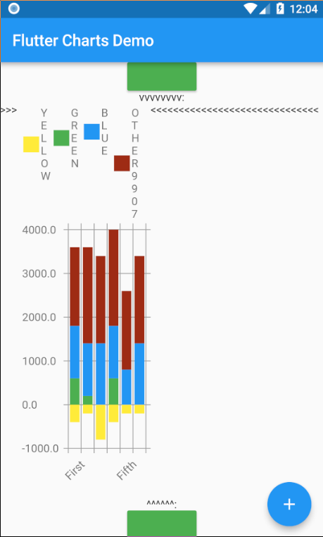
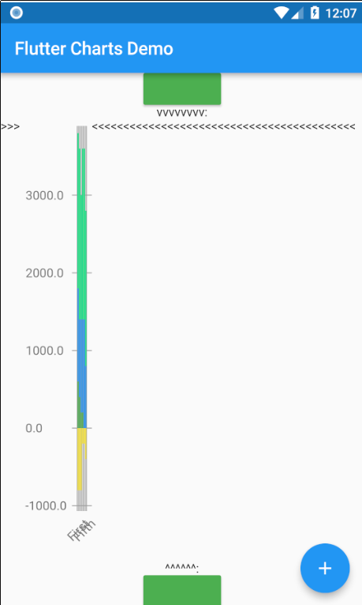
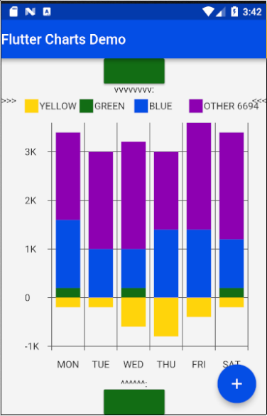
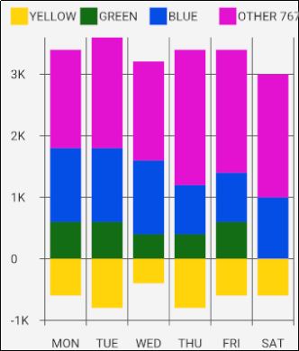
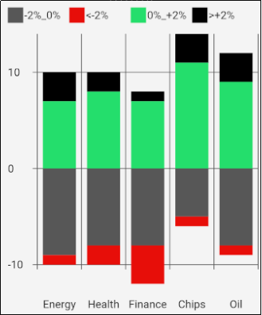

# Table of Contents

1.  [New in the current release](#orgc6bc82e)
    1.  [Illustration of the new "iterative auto layout" feature](#org5844188)
        1.  [Autolayout step 1](#org908eb52)
        2.  [Autolayout step 2](#org42945b0)
        3.  [Autolayout step 3](#org646dcfb)
        4.  [Autolayout step 4](#orge2115cf)
        5.  [Autolayout step 5](#org283a53c)
2.  [Flutter Charts - How to include the flutter\_charts library in your application](#org498c1ac)
3.  [A chart created using flutter\_charts - example application](#orgbf1b0ea)
4.  [Known packages, libraries and apps that use this this flutter\_charts package](#org7ca7238)
5.  [Flutter Charts - an overview: data, options, classes](#orgea29e4e)
6.  [Flutter beginner: Experimenting with Flutter using Flutter Charts](#org1378383)
7.  [Flutter Charts - examples: LineChart and VerticalBarChart. Code and resulting charts](#org820bfaf)
    1.  [Random Data (Y values), Random X Labels, Random Colors, Random Data Rows Legends, Data-Generated Y Labels.](#org8d7944a)
    2.  [User-Provided Data (Y values), User-Provided X Labels, Random Colors, User-Provided Data Rows Legends, Data-Generated Y Labels,](#orgab9b637)
    3.  [User-Provided Data (Y values), User-Provided X Labels, Random Colors, User-Provided Data Rows Legends, User-Provided Y Labels](#orgc5d954a)
8.  [VerticalBar Chart - one more example, showing positive/negative stacks:](#org31ee3ac)
    1.  [User-Provided Data (Y values), User-Provided X Labels, User-Provided Colors, User-Provided Data Rows Legends, User-Provided Y Labels](#org5aac946)

# New in the current release

Current release 0.1.8.

See <CHANGELOG.md> for the list of new features and bug fixes in this release.

As noticed in the CHANGELOG, perhaps the most important new feature is the "iterative auto layout" of labels. 

Labels auto layout is a sequence of steps, such as skipping some labels, tilting labels, or decreasing label font, that result in label 'fit' nicely, readably, without overflowing or running into each other.

## Illustration of the new "iterative auto layout" feature

This section illustrates how the auto layout behaves when less and less horizontal space is available to display the chart. 

Flutter chart library automatically checks for the X label overlap, and follows with rule-based iterative re-layout, to prevent labels running into each other.

To illustrate "stressed" horizontal space for the chart, we are gradually adding a text widget containing and increasing number of '<' signs on the right of the chart.

### Autolayout step 1

Let's say there are six labels on a chart, and sufficient space to display labels horizontally. The result may look like this:

We can see all x axis labels displayed it full, horizontally oriented.

### Autolayout step 2

Next, let us make less available space by taking away some space on the right with a wider text label like this '<<<<<<'

We can see the labels were automatically tilted by angle `ChartOptions labelTiltRadians` for the labels to fit.

### Autolayout step 3

Next, let us make even less available space by taking away some space on the right with a wider text label like this '<<<<<<<<<<<'.

We can see that labels are not only tilted, but also automatically skipped (every 2nd) for labels not to overlap.

### Autolayout step 4

Next, let us make even less available space some more compared to step 3, with even a wider text label like this '<<<<<<<<<<<<<<<<<<<<<<<<<<<<<<'.

We can see even more labels were skipped for labels to prevent overlap, the chart is showing evey 5th label

### Autolayout step 5

Last, let us take away extreme amount of horizontal space by using '<<<<<<<<<<<<<<<<<<<<<<<<<<<<<<<<<<<<<<<<<<',

Here we can see the "default auto layout" finally gave up, and overlaps labels. Also, the legend is now hidded, as there is not enough horizontal space.

# Flutter Charts - How to include the flutter\_charts library in your application

Flutter Charts is a charting library for Flutter, written in Flutter. Currently, column chart and line chart are supported.

The package is published on pub for inclusion in your application's `pubspec.yaml`: The *Installing* tab on <https://pub.dartlang.org/packages/flutter_charts> contains instructions on how to include the *flutter\_charts* package in your application.

# A chart created using flutter\_charts - example application

There is an example application in flutter\_charts: `example/lib/main.dart`. It shows how a Flutter Chart can be included in a Flutter application.

You can run the example application using one of the methods (6, 7) in the paragraph below.

This application is also used as a base to show several sample charts in the paragraphs below.

Here we show just two simple sample outputs, a column chart and a line chart.

A sample Vertical Bar Chart (Column Chart)

A sample point and Line Chart (Line Chart)

The output is generated from semi-random data. You can click the blue + button to rerun the chart with a different set of rows.

# Known packages, libraries and apps that use this this flutter\_charts package

1.  Michael R. Fairhurst's **Language reader app** - see <https://github.com/MichaelRFairhurst/flutter-language-reader-app>

# Flutter Charts - an overview: data, options, classes

Before we show several examples of charts, a few notes. 

-   The `ChartData` class: allows to define data - X labels, Y values, (optional) Y labels, each-dataRow (series) legends, each-dataRow (series) color. The list below provides a summary description of each item
    -   X labels: `ChartData.xLabels` allow to define X labels. Setting `xLabels` is required, but client can set them to empty strings.
    -   Y values: `ChartData.dataRows` allow to define Y values in rows. Assumption: size of each data row in `ChartData.dataRows` is the same, and each data row size ==  `ChartData.xLabels.size`
    -   Y labels (optional): Normally, Y labels are generated from data. The option `ChartOptions.useUserProvidedYLabels` (default *true*), asks flutter\_charts to data-generate Y labels. If this option is set to *false*, then `ChartData.yLabels` must be set. Any number of such user-provided Y labels is allowed.
    -   Each-dataRow (each series) legends: `ChartData.dataRowsLegends` allow to define a legend for each data row in  `ChartData.dataRows`. Assumption:  `ChartData.dataRows.size` ==  `ChartData.dataRowsLegends.size`
    -   Each-dataRow (each series) color: `ChartData.dataRowsColors` allow to define a color for each data row in  `ChartData.dataRows`. Assumption:  `ChartData.dataRows.size` ==  `ChartData.dataRowsColors.size`
-   The  `ChartOptions` class: allows to define options, by using it's defaults, or setting some options to non default values. There are also `LineChartOptions` and `VerticalBarChartOptions` classes.
-   Support for randomly generated data, colors, labels: Flutter Charts also provides randomly generated data, in the class `RandomChartData`. This class generates:
    -   Y values data,
    -   X labels,
    -   Series colors,
    -   Series legends
-   Currently the only purpose of `RandomChartData` is for use in the examples below. To be clear, `RandomChartData` Y values, series colors, and series legends are not completely random - they hardcode some demoable label, legends, color values, and data ranges (data random within the range).

# Flutter beginner: Experimenting with Flutter using Flutter Charts

This section describes, very briefly with links, how to install Flutter, and the Flutter Charts package.

This section We describe running Flutter Charts in development mode on your device (Android, iOS - follow 1, 2 or 3, 4 and 6), or alternatively on a device emulator (device emulator running from an IDE such as IntelliJ with Android Studio installed - follow 1, 2 or 3, 5, 6 or 7).

1.  Install Flutter on your computer. See the installation section on <https://flutter.io/>.
2.  Clone flutter\_charts code from Github to your computer. Needs git client.
    
        cd DIRECTORY_OF_CHOICE
        git clone https://github.com/mzimmerm/flutter_charts.git
        # clone will create directory  flutter_charts
        cd flutter_charts

3.  (Alternative to 2.): Download and unzip flutter\_charts code from Github
    -   Browse to  <https://github.com/mzimmerm/flutter_charts.git>
    -   On the righ top, click on the "Clone or Download" button, then select save Zip, save and extract to  DIRECTORY\_OF\_CHOICE
    -   cd flutter\_charts
4.  Prepare a physical device (must be set to Development Mode) to run applications from your computer. Then connect a android device in development mode to your computer. See <https://www.kingoapp.com/root-tutorials/how-to-enable-usb-debugging-mode-on-android.htm>

5.  (Alternative to 4.): Prepare and start an Android device emulator on your computer.
    -   Install Android Studio: see <https://developer.android.com/studio/index.html>
    
    -   Install an IDE such as IntelliJ with Flutter plugin. See <https://flutter.io/intellij-setup/>

6.  Run Flutter Charts demo app from command line (this will work in both method 4. and method 5.)
    
        cd DIRECTORY_OF_CHOICE/flutter_charts 
        flutter run example/lib/main.dart

7.  (Alternative to 6.) Run  Flutter Charts demo app from IDE. This will work only with method 5. 
    -   Start IntelliJ IDE, create a project in the `DIRECTORY_OF_CHOICE/flutter_charts` start an Android emulator, then click on the Run button in Intellij (which should show the `file:example/lib/main.dart` in the run button).

# Flutter Charts - examples: LineChart and VerticalBarChart. Code and resulting charts

Flutter Charts code allow to define the following data elements:

<table border="2" cellspacing="0" cellpadding="6" rules="groups" frame="hsides">

<colgroup>
<col  class="org-left" />

<col  class="org-left" />
</colgroup>
<tbody>
<tr>
<td class="org-left">*Data (Y values)*</td>
<td class="org-left">User-Provided or Random</td>
</tr>

<tr>
<td class="org-left">*X Labels*</td>
<td class="org-left">User-Provided or Random</td>
</tr>

<tr>
<td class="org-left">*Options including Colors*</td>
<td class="org-left">User-Provided or Random</td>
</tr>

<tr>
<td class="org-left">*Data Rows Legends*</td>
<td class="org-left">User-Provided or Random</td>
</tr>

<tr>
<td class="org-left">*Y Labels*</td>
<td class="org-left">User-Provided or Data-Generated</td>
</tr>
</tbody>
</table>

The examples below show a few alternative code snippets (User-Provided or Random data, labels, option) and the resulting charts.

The chart images were obtained by substituting the code snippet to the `file:example/lib/main.dart` code. 

## Random Data (Y values), Random X Labels, Random Colors, Random Data Rows Legends, Data-Generated Y Labels.

This example shows that Data-Generated Y labels is the default.  
Flutter Charts support reasonably intelligently generated Y Labels from data, including dealing with negatives.

Code in `defineOptionsAndData()`:

    void defineOptionsAndData() {
      _lineChartOptions = new LineChartOptions();
      _verticalBarChartOptions = new VerticalBarChartOptions();
      _chartData = new RandomChartData(useUserProvidedYLabels: _lineChartOptions.useUserProvidedYLabels);
    }

Result line chart:

Result vertical bar chart:

## User-Provided Data (Y values), User-Provided X Labels, Random Colors, User-Provided Data Rows Legends, Data-Generated Y Labels,

Code in `defineOptionsAndData()`:

    void defineOptionsAndData() {
      _lineChartOptions = new LineChartOptions();
      _verticalBarChartOptions = new VerticalBarChartOptions();
      _chartData = new ChartData();
      _chartData.dataRowsLegends = [
        "Spring",
        "Summer",
        "Fall",
        "Winter"];
      _chartData.dataRows = [
        [10.0, 20.0,  5.0,  30.0,  5.0,  20.0, ],
        [30.0, 60.0, 16.0, 100.0, 12.0, 120.0, ],
        [25.0, 40.0, 20.0,  80.0, 12.0,  90.0, ],
        [12.0, 30.0, 18.0,  40.0, 10.0,  30.0, ],
      ];
      _chartData.xLabels =  ["Wolf", "Deer", "Owl", "Mouse", "Hawk", "Vole"];
      _chartData.assignDataRowsDefaultColors();
      // Note: ChartOptions.useUserProvidedYLabels default is still used (false);
    }

Result line chart:

Result vertical bar chart:

## User-Provided Data (Y values), User-Provided X Labels, Random Colors, User-Provided Data Rows Legends, User-Provided Y Labels

This example show how to use the option `useUserProvidedYLabels`, and scaling of data to the Y labels range.

Code in `defineOptionsAndData()`:

    void defineOptionsAndData() {
      // This example shows user defined Y Labels.
      //   When setting Y labels by user, the dataRows value scale
      //   is irrelevant. User can use for example interval <0, 1>,
      //   <0, 10>, or any other, even negative ranges. Here we use <0-10>.
      //   The only thing that matters is  the relative values in the data Rows.
    
      // Note that current implementation sets
      // the minimum of dataRows range (1.0 in this example)
      // on the level of the first Y Label ("Ok" in this example),
      // and the maximum  of dataRows range (10.0 in this example)
      // on the level of the last Y Label ("High" in this example).
      // This is not desirable, we need to add a userProvidedYLabelsBoundaryMin/Max.
      _lineChartOptions = new LineChartOptions();
      _verticalBarChartOptions = new VerticalBarChartOptions();
      _chartData = new ChartData();
      _chartData.dataRowsLegends = [
        "Java",
        "Dart",
        "Python",
        "Newspeak"];
      _chartData.dataRows = [
        [9.0, 4.0,  3.0,  9.0, ],
        [7.0, 6.0,  7.0,  6.0, ],
        [4.0, 9.0,  6.0,  8.0, ],
        [3.0, 9.0, 10.0,  1.0, ],
      ];
      _chartData.xLabels =  ["Fast", "Readable", "Novel", "Use"];
      _chartData.dataRowsColors = [
        Colors.blue,
        Colors.yellow,
        Colors.green,
        Colors.amber,
      ];
      _lineChartOptions.useUserProvidedYLabels = true; // use the labels below on Y axis
      _chartData.yLabels = [
        "Ok",
        "Higher",
        "High",
      ];
    }

Result line chart:

(Disclaimer: Not actually measured)

Result vertical bar chart: Here the Y values should be numeric (if any) as manual labeling "Ok", "Higher", High" does not make sense for stacked type charts.

(Disclaimer: Not actually measured)

# VerticalBar Chart - one more example, showing positive/negative stacks:

## User-Provided Data (Y values), User-Provided X Labels, User-Provided Colors, User-Provided Data Rows Legends, User-Provided Y Labels

This example has again user defined Y Labels, with a bar chart, using the smart auto-layout of user defined Y Labels. The chart shows negative and positive values similar to %down/%up stock charts.

Code in `defineOptionsAndData()`:

    void defineOptionsAndData() {
      // This example shows user defined Y Labels with
      // a bar chart, showing negative and positive values
      // similar to %down/%up stock charts.
      _lineChartOptions = new LineChartOptions();
      _verticalBarChartOptions = new VerticalBarChartOptions();
      _chartData = new ChartData();
      _chartData.dataRowsLegends = [
        "-2%_0%",
        "<-2%",
        "0%_+2%",
        ">+2%"];
      // each column absolute values should add to same number todo- 100 would make more sense, to represent 100% of stocks in each category
      _chartData.dataRows = [
        [-9.0, -8.0,  -8.0,  -5.0, -8.0, ],
        [-1.0, -2.0,  -4.0,  -1.0, -1.0, ],
        [7.0, 8.0,  7.0, 11.0, 9.0, ],
        [3.0, 2.0, 1.0,  3.0,  3.0, ],
      ];
      _chartData.xLabels =  ["Energy", "Health", "Finance", "Chips", "Oil"];
      _chartData.dataRowsColors = [
        Colors.grey,
        Colors.red,
        Colors.greenAccent,
        Colors.black,
      ];
      _lineChartOptions.useUserProvidedYLabels = false; // use labels below
      //_chartData.yLabels = [
      //  "Ok",
      //  "Higher",
      //  "High",
      //];
    }

Result vertical bar chart:

(there is a bug here,see Known Bugs)

