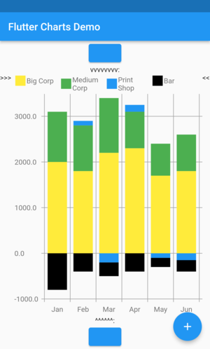

# Table of Contents

1.  [Examples with code](#org36f6739)
    1.  [ex10RandomData\_lineChart ](#orgacc561e)
    2.  [ex10RandomData\_verticalBarChart ](#org85819e7)
    3.  [ex11RandomDataWithLabelLayoutStrategy\_lineChart ](#orgce05372)
    4.  [ex11RandomDataWithLabelLayoutStrategy\_verticalBarChart ](#org033b22b)
    5.  [ex30AnimalsBySeasonWithLabelLayoutStrategy\_lineChart ](#org587e417)
    6.  [ex30AnimalsBySeasonWithLabelLayoutStrategy\_verticalBarChart ](#org91e1a6b)
    7.  [ex31SomeNegativeValues\_lineChart ](#org49c30c2)
    8.  [ex31SomeNegativeValues\_verticalBarChart ](#org4b289cc)
    9.  [ex32AllPositiveYsYAxisStartsAbove0\_lineChart ](#orgd42a2f3)
    10. [ex32AllPositiveYsYAxisStartsAbove0\_verticalBarChart ](#org5e83572)
    11. [ex33AllNegativeYsYAxisEndsBelow0\_lineChart ](#orgf856ba1)
    12. [ex35AnimalsBySeasonNoLabelsShown\_lineChart ](#orge9bbc22)
    13. [ex35AnimalsBySeasonNoLabelsShown\_verticalBarChart ](#org8bf69e6)
    14. [ex40LanguagesWithYOrdinalUserLabelsAndUserColors\_lineChart ](#orgc5cee04)
    15. [ex50StocksWithNegativesWithUserColors\_verticalBarChart ](#org6932eec)
    16. [ex52AnimalsBySeasonLogarithmicScale\_lineChart ](#org6d0092e)
    17. [ex52AnimalsBySeasonLogarithmicScale\_verticalBarChart ](#org47ef7bc)
    18. [ex900ErrorFixUserDataAllZero\_lineChart ](#org94fde50)
2.  [Latest release changes](#orgfe79b03)
3.  [Installation](#org07f67e2)
    1.  [Installing flutter\_charts as a library package into your app](#org6b0373d)
    2.  [Installing the flutter\_charts project as a local clone from Github](#org0026998)
4.  [Running the examples included in flutter\_charts](#orga4839cc)
5.  [Illustration of the "iterative auto layout" feature](#org4ab3e54)
    1.  [Autolayout step 1](#org27142b6)
    2.  [Autolayout step 2](#org7fbe5e9)
    3.  [Autolayout step 3](#orgfb5a0d4)
    4.  [Autolayout step 4](#org006f712)
    5.  [Autolayout step 5](#org844c5a3)
6.  [Known packages, libraries and apps that use this flutter\_charts package](#org08bd488)
7.  [Todos](#orgaef4199)
8.  [Internal notes for exporting this document](#orge717b5f)

# Examples with code

This section contains sample results from flutter\_charts. 

<table border="2" cellspacing="0" cellpadding="6" rules="groups" frame="hsides">

<colgroup>
<col  class="org-left" />

<col  class="org-left" />

<col  class="org-left" />

<col  class="org-left" />

<col  class="org-left" />
</colgroup>
<tbody>
<tr>
<td class="org-left"></td>
<td class="org-left"></td>
<td class="org-left"></td>
<td class="org-left"></td>
<td class="org-left">&#xa0;</td>
</tr>

<tr>
<td class="org-left"></td>
<td class="org-left"></td>
<td class="org-left"></td>
<td class="org-left"></td>
<td class="org-left">&#xa0;</td>
</tr>

<tr>
<td class="org-left"></td>
<td class="org-left"></td>
<td class="org-left"></td>
<td class="org-left"></td>
<td class="org-left">&#xa0;</td>
</tr>

<tr>
<td class="org-left"></td>
<td class="org-left"></td>
<td class="org-left"></td>
<td class="org-left"></td>
<td class="org-left">&#xa0;</td>
</tr>

<tr>
<td class="org-left"></td>
<td class="org-left"></td>
<td class="org-left">&#xa0;</td>
<td class="org-left">&#xa0;</td>
<td class="org-left">&#xa0;</td>
</tr>
</tbody>
</table>

## ex10RandomData\_lineChart 

Code

    Widget chartToRun() {
      LabelLayoutStrategy? xContainerLabelLayoutStrategy;
      ChartData chartData;
      ChartOptions chartOptions = const ChartOptions();
      chartData = RandomChartData.generated(chartOptions: chartOptions);
      var lineChartContainer = LineChartTopContainer(
        chartData: chartData,
        xContainerLabelLayoutStrategy: xContainerLabelLayoutStrategy,
      );
    
      var lineChart = LineChart(
        painter: LineChartPainter(
          lineChartContainer: lineChartContainer,
        ),
      );
      return lineChart;
    }

Result

## ex10RandomData\_verticalBarChart 

Code

    Widget chartToRun() {
      LabelLayoutStrategy? xContainerLabelLayoutStrategy;
      ChartData chartData;
      ChartOptions chartOptions = const ChartOptions();
      chartData = RandomChartData.generated(chartOptions: chartOptions);
      var verticalBarChartContainer = VerticalBarChartTopContainer(
        chartData: chartData,
        xContainerLabelLayoutStrategy: xContainerLabelLayoutStrategy,
      );
    
      var verticalBarChart = VerticalBarChart(
        painter: VerticalBarChartPainter(
          verticalBarChartContainer: verticalBarChartContainer,
        ),
      );
      return verticalBarChart;
    }

Result

## ex11RandomDataWithLabelLayoutStrategy\_lineChart 

Code

    Widget chartToRun() {
      LabelLayoutStrategy? xContainerLabelLayoutStrategy;
      ChartData chartData;
      ChartOptions chartOptions = const ChartOptions();
      xContainerLabelLayoutStrategy = DefaultIterativeLabelLayoutStrategy(
      options: chartOptions,
      );
      chartData = RandomChartData.generated(chartOptions: chartOptions);
      var lineChartContainer = LineChartTopContainer(
        chartData: chartData,
        xContainerLabelLayoutStrategy: xContainerLabelLayoutStrategy,
      );
    
      var lineChart = LineChart(
        painter: LineChartPainter(
          lineChartContainer: lineChartContainer,
        ),
      );
      return lineChart;
    }

Result

## ex11RandomDataWithLabelLayoutStrategy\_verticalBarChart 

Code

    Widget chartToRun() {
      LabelLayoutStrategy? xContainerLabelLayoutStrategy;
      ChartData chartData;
      ChartOptions chartOptions = const ChartOptions();
      xContainerLabelLayoutStrategy = DefaultIterativeLabelLayoutStrategy(
      options: chartOptions,
      );
      chartData = RandomChartData.generated(chartOptions: chartOptions);
      var verticalBarChartContainer = VerticalBarChartTopContainer(
        chartData: chartData,
        xContainerLabelLayoutStrategy: xContainerLabelLayoutStrategy,
      );
    
      var verticalBarChart = VerticalBarChart(
        painter: VerticalBarChartPainter(
          verticalBarChartContainer: verticalBarChartContainer,
        ),
      );
      return verticalBarChart;
    }

Result

## ex30AnimalsBySeasonWithLabelLayoutStrategy\_lineChart 

Code

    Widget chartToRun() {
      LabelLayoutStrategy? xContainerLabelLayoutStrategy;
      ChartData chartData;
      ChartOptions chartOptions = const ChartOptions();
      // Shows explicit use of DefaultIterativeLabelLayoutStrategy with Random values and labels.
      // The xContainerLabelLayoutStrategy, if set to null or not set at all, defaults to DefaultIterativeLabelLayoutStrategy
      // Clients can also create their own LayoutStrategy.
      xContainerLabelLayoutStrategy = DefaultIterativeLabelLayoutStrategy(
      options: chartOptions,
      );
      chartData = ChartData(
      dataRows: const [
      [10.0, 20.0, 5.0, 30.0, 5.0, 20.0],
      [30.0, 60.0, 16.0, 100.0, 12.0, 120.0],
      [25.0, 40.0, 20.0, 80.0, 12.0, 90.0],
      [12.0, 30.0, 18.0, 40.0, 10.0, 30.0],
      ],
      xUserLabels: const ['Wolf', 'Deer', 'Owl', 'Mouse', 'Hawk', 'Vole'],
      dataRowsLegends: const [
      'Spring',
      'Summer',
      'Fall',
      'Winter',
      ],
      chartOptions: chartOptions,
      );
      // chartData.dataRowsDefaultColors(); // if not set, called in constructor
      var lineChartContainer = LineChartTopContainer(
        chartData: chartData,
        xContainerLabelLayoutStrategy: xContainerLabelLayoutStrategy,
      );
    
      var lineChart = LineChart(
        painter: LineChartPainter(
          lineChartContainer: lineChartContainer,
        ),
      );
      return lineChart;
    }

Result

## ex30AnimalsBySeasonWithLabelLayoutStrategy\_verticalBarChart 

Code

    Widget chartToRun() {
      LabelLayoutStrategy? xContainerLabelLayoutStrategy;
      ChartData chartData;
      ChartOptions chartOptions = const ChartOptions();
      // Shows explicit use of DefaultIterativeLabelLayoutStrategy with Random values and labels.
      // The xContainerLabelLayoutStrategy, if set to null or not set at all, defaults to DefaultIterativeLabelLayoutStrategy
      // Clients can also create their own LayoutStrategy.
      xContainerLabelLayoutStrategy = DefaultIterativeLabelLayoutStrategy(
      options: chartOptions,
      );
      chartData = ChartData(
      dataRows: const [
      [10.0, 20.0, 5.0, 30.0, 5.0, 20.0],
      [30.0, 60.0, 16.0, 100.0, 12.0, 120.0],
      [25.0, 40.0, 20.0, 80.0, 12.0, 90.0],
      [12.0, 30.0, 18.0, 40.0, 10.0, 30.0],
      ],
      xUserLabels: const ['Wolf', 'Deer', 'Owl', 'Mouse', 'Hawk', 'Vole'],
      dataRowsLegends: const [
      'Spring',
      'Summer',
      'Fall',
      'Winter',
      ],
      chartOptions: chartOptions,
      );
      // chartData.dataRowsDefaultColors(); // if not set, called in constructor
      var verticalBarChartContainer = VerticalBarChartTopContainer(
        chartData: chartData,
        xContainerLabelLayoutStrategy: xContainerLabelLayoutStrategy,
      );
    
      var verticalBarChart = VerticalBarChart(
        painter: VerticalBarChartPainter(
          verticalBarChartContainer: verticalBarChartContainer,
        ),
      );
      return verticalBarChart;
    }

Result

## ex31SomeNegativeValues\_lineChart 

Code

    Widget chartToRun() {
      LabelLayoutStrategy? xContainerLabelLayoutStrategy;
      ChartData chartData;
      ChartOptions chartOptions = const ChartOptions();
      chartData = ChartData(
      dataRows: const [
      [2000.0, 1800.0, 2200.0, 2300.0, 1700.0, 1800.0],
      [1100.0, 1000.0, 1200.0, 800.0, 700.0, 800.0],
      [0.0, 100.0, -200.0, 150.0, -100.0, -150.0],
      [-800.0, -400.0, -300.0, -400.0, -200.0, -250.0],
      ],
      xUserLabels: const ['Jan', 'Feb', 'Mar', 'Apr', 'May', 'Jun'],
      dataRowsLegends: const [
      'Big Corp',
      'Medium Corp',
      'Print Shop',
      'Bar',
      ],
      chartOptions: chartOptions,
      );
      var lineChartContainer = LineChartTopContainer(
        chartData: chartData,
        xContainerLabelLayoutStrategy: xContainerLabelLayoutStrategy,
      );
    
      var lineChart = LineChart(
        painter: LineChartPainter(
          lineChartContainer: lineChartContainer,
        ),
      );
      return lineChart;
    }

Result

## ex31SomeNegativeValues\_verticalBarChart 

Code

    Widget chartToRun() {
      LabelLayoutStrategy? xContainerLabelLayoutStrategy;
      ChartData chartData;
      ChartOptions chartOptions = const ChartOptions();
      chartData = ChartData(
      dataRows: const [
      [2000.0, 1800.0, 2200.0, 2300.0, 1700.0, 1800.0],
      [1100.0, 1000.0, 1200.0, 800.0, 700.0, 800.0],
      [0.0, 100.0, -200.0, 150.0, -100.0, -150.0],
      [-800.0, -400.0, -300.0, -400.0, -200.0, -250.0],
      ],
      xUserLabels: const ['Jan', 'Feb', 'Mar', 'Apr', 'May', 'Jun'],
      dataRowsLegends: const [
      'Big Corp',
      'Medium Corp',
      'Print Shop',
      'Bar',
      ],
      chartOptions: chartOptions,
      );
      var verticalBarChartContainer = VerticalBarChartTopContainer(
        chartData: chartData,
        xContainerLabelLayoutStrategy: xContainerLabelLayoutStrategy,
      );
    
      var verticalBarChart = VerticalBarChart(
        painter: VerticalBarChartPainter(
          verticalBarChartContainer: verticalBarChartContainer,
        ),
      );
      return verticalBarChart;
    }

Result

## ex32AllPositiveYsYAxisStartsAbove0\_lineChart 

Code

    Widget chartToRun() {
      LabelLayoutStrategy? xContainerLabelLayoutStrategy;
      ChartData chartData;
      ChartOptions chartOptions = const ChartOptions();
      // Set option which will ask to start Y axis at data minimum.
      // Even though startYAxisAtDataMinRequested set to true, will not be granted on bar chart
      chartOptions = const ChartOptions(
      dataContainerOptions: DataContainerOptions(
      startYAxisAtDataMinRequested: true,
      ),
      );
      chartData = ChartData(
      dataRows: const [
      [20.0, 25.0, 30.0, 35.0, 40.0, 20.0],
      [35.0, 40.0, 20.0, 25.0, 30.0, 20.0],
      ],
      xUserLabels: const ['Jan', 'Feb', 'Mar', 'Apr', 'May', 'Jun'],
      dataRowsLegends: const [
      'Off zero 1',
      'Off zero 2',
      ],
      chartOptions: chartOptions,
      );
      var lineChartContainer = LineChartTopContainer(
        chartData: chartData,
        xContainerLabelLayoutStrategy: xContainerLabelLayoutStrategy,
      );
    
      var lineChart = LineChart(
        painter: LineChartPainter(
          lineChartContainer: lineChartContainer,
        ),
      );
      return lineChart;
    }

Result

## ex32AllPositiveYsYAxisStartsAbove0\_verticalBarChart 

Code

    Widget chartToRun() {
      LabelLayoutStrategy? xContainerLabelLayoutStrategy;
      ChartData chartData;
      ChartOptions chartOptions = const ChartOptions();
      // Set option which will ask to start Y axis at data minimum.
      // Even though startYAxisAtDataMinRequested set to true, will not be granted on bar chart
      chartOptions = const ChartOptions(
      dataContainerOptions: DataContainerOptions(
      startYAxisAtDataMinRequested: true,
      ),
      );
      chartData = ChartData(
      dataRows: const [
      [20.0, 25.0, 30.0, 35.0, 40.0, 20.0],
      [35.0, 40.0, 20.0, 25.0, 30.0, 20.0],
      ],
      xUserLabels: const ['Jan', 'Feb', 'Mar', 'Apr', 'May', 'Jun'],
      dataRowsLegends: const [
      'Off zero 1',
      'Off zero 2',
      ],
      chartOptions: chartOptions,
      );
      var verticalBarChartContainer = VerticalBarChartTopContainer(
        chartData: chartData,
        xContainerLabelLayoutStrategy: xContainerLabelLayoutStrategy,
      );
    
      var verticalBarChart = VerticalBarChart(
        painter: VerticalBarChartPainter(
          verticalBarChartContainer: verticalBarChartContainer,
        ),
      );
      return verticalBarChart;
    }

Result

## ex33AllNegativeYsYAxisEndsBelow0\_lineChart 

Code

    Widget chartToRun() {
      LabelLayoutStrategy? xContainerLabelLayoutStrategy;
      ChartData chartData;
      ChartOptions chartOptions = const ChartOptions();
      // Ask to end Y axis at maximum data (as all data negative)
      chartOptions = const ChartOptions(
      dataContainerOptions: DataContainerOptions(
      startYAxisAtDataMinRequested: true,
      ),
      );
      chartData = ChartData(
      dataRows: const [
      [-20.0, -25.0, -30.0, -35.0, -40.0, -20.0],
      [-35.0, -40.0, -20.0, -25.0, -30.0, -20.0],
      ],
      xUserLabels: const ['Jan', 'Feb', 'Mar', 'Apr', 'May', 'Jun'],
      dataRowsLegends: const [
      'Off zero 1',
      'Off zero 2',
      ],
      chartOptions: chartOptions,
      );
      var lineChartContainer = LineChartTopContainer(
        chartData: chartData,
        xContainerLabelLayoutStrategy: xContainerLabelLayoutStrategy,
      );
    
      var lineChart = LineChart(
        painter: LineChartPainter(
          lineChartContainer: lineChartContainer,
        ),
      );
      return lineChart;
    }

Result

## ex35AnimalsBySeasonNoLabelsShown\_lineChart 

Code

    Widget chartToRun() {
      LabelLayoutStrategy? xContainerLabelLayoutStrategy;
      ChartData chartData;
      ChartOptions chartOptions = const ChartOptions();
      // Set chart options to show no labels
      chartOptions = const ChartOptions.noLabels();
    
      chartData = ChartData(
      dataRows: const [
      [10.0, 20.0, 5.0, 30.0, 5.0, 20.0],
      [30.0, 60.0, 16.0, 100.0, 12.0, 120.0],
      [25.0, 40.0, 20.0, 80.0, 12.0, 90.0],
      [12.0, 30.0, 18.0, 40.0, 10.0, 30.0],
      ],
      xUserLabels: const ['Wolf', 'Deer', 'Owl', 'Mouse', 'Hawk', 'Vole'],
      dataRowsLegends: const [
      'Spring',
      'Summer',
      'Fall',
      'Winter',
      ],
      chartOptions: chartOptions,
      );
      var lineChartContainer = LineChartTopContainer(
        chartData: chartData,
        xContainerLabelLayoutStrategy: xContainerLabelLayoutStrategy,
      );
    
      var lineChart = LineChart(
        painter: LineChartPainter(
          lineChartContainer: lineChartContainer,
        ),
      );
      return lineChart;
    }

Result

## ex35AnimalsBySeasonNoLabelsShown\_verticalBarChart 

Code

    Widget chartToRun() {
      LabelLayoutStrategy? xContainerLabelLayoutStrategy;
      ChartData chartData;
      ChartOptions chartOptions = const ChartOptions();
      // Set chart options to show no labels
      chartOptions = const ChartOptions.noLabels();
    
      chartData = ChartData(
      dataRows: const [
      [10.0, 20.0, 5.0, 30.0, 5.0, 20.0],
      [30.0, 60.0, 16.0, 100.0, 12.0, 120.0],
      [25.0, 40.0, 20.0, 80.0, 12.0, 90.0],
      [12.0, 30.0, 18.0, 40.0, 10.0, 30.0],
      ],
      xUserLabels: const ['Wolf', 'Deer', 'Owl', 'Mouse', 'Hawk', 'Vole'],
      dataRowsLegends: const [
      'Spring',
      'Summer',
      'Fall',
      'Winter',
      ],
      chartOptions: chartOptions,
      );
      var verticalBarChartContainer = VerticalBarChartTopContainer(
        chartData: chartData,
        xContainerLabelLayoutStrategy: xContainerLabelLayoutStrategy,
      );
    
      var verticalBarChart = VerticalBarChart(
        painter: VerticalBarChartPainter(
          verticalBarChartContainer: verticalBarChartContainer,
        ),
      );
      return verticalBarChart;
    }

Result

## ex40LanguagesWithYOrdinalUserLabelsAndUserColors\_lineChart 

Code

    Widget chartToRun() {
      LabelLayoutStrategy? xContainerLabelLayoutStrategy;
      ChartData chartData;
      ChartOptions chartOptions = const ChartOptions();
      // User-Provided Data (Y values), User-Provided X Labels, User-Provided Data Rows Legends, User-Provided Y Labels, User-Provided Colors
      // This example shows user defined Y Labels that derive order from data.
      //   When setting Y labels by user, the dataRows value scale
      //   is irrelevant. User can use for example interval <0, 1>,
      //   <0, 10>, or any other, even negative ranges. Here we use <0-10>.
      //   The only thing that matters is  the relative values in the data Rows.
      // Current implementation sets
      //   the minimum of dataRows range (1.0 in this example)
      //     on the level of the first Y Label ("Low" in this example),
      //   and the maximum  of dataRows range (10.0 in this example)
      //     on the level of the last Y Label ("High" in this example).
      chartData = ChartData(
      dataRows: const [
      [9.0, 4.0, 3.0, 9.0],
      [7.0, 6.0, 7.0, 6.0],
      [4.0, 9.0, 6.0, 8.0],
      [3.0, 9.0, 10.0, 1.0],
      ],
      xUserLabels: const ['Speed', 'Readability', 'Level of Novel', 'Usage'],
      dataRowsColors: const [
      Colors.blue,
      Colors.yellow,
      Colors.green,
      Colors.amber,
      ],
      dataRowsLegends: const ['Java', 'Dart', 'Python', 'Newspeak'],
      yUserLabels: const [
      'Low',
      'Medium',
      'High',
      ],
      chartOptions: chartOptions,
      );
    
      var lineChartContainer = LineChartTopContainer(
        chartData: chartData,
        xContainerLabelLayoutStrategy: xContainerLabelLayoutStrategy,
      );
    
      var lineChart = LineChart(
        painter: LineChartPainter(
          lineChartContainer: lineChartContainer,
        ),
      );
      return lineChart;
    }

Result

## ex50StocksWithNegativesWithUserColors\_verticalBarChart 

Code

    Widget chartToRun() {
      LabelLayoutStrategy? xContainerLabelLayoutStrategy;
      ChartData chartData;
      ChartOptions chartOptions = const ChartOptions();
      // User-Provided Data (Y values), User-Provided X Labels, User-Provided Data Rows Legends, Data-Based Y Labels, User-Provided Colors,
      //        This shows a bug where negatives go below X axis.
      // If we want the chart to show User-Provided textual Y labels with
      // In each column, adding it's absolute values should add to same number:
      // todo-11-examples 100 would make more sense, to represent 100% of stocks in each category.
    
      chartData = ChartData(
      // each column should add to same number. everything else is relative. todo-11-examples maybe no need to add to same number.
      dataRows: const [
      [-9.0, -8.0, -8.0, -5.0, -8.0],
      [-1.0, -2.0, -4.0, -1.0, -1.0],
      [7.0, 8.0, 7.0, 11.0, 9.0],
      [3.0, 2.0, 1.0, 3.0, 3.0],
      ],
      xUserLabels: const ['Energy', 'Health', 'Finance', 'Chips', 'Oil'],
      dataRowsLegends: const [
      '-2% or less',
      '-2% to 0%',
      '0% to +2%',
      'more than +2%',
      ],
      dataRowsColors: const [
      Colors.red,
      Colors.grey,
      Colors.greenAccent,
      Colors.black,
      ],
      chartOptions: chartOptions,
      );
      var verticalBarChartContainer = VerticalBarChartTopContainer(
        chartData: chartData,
        xContainerLabelLayoutStrategy: xContainerLabelLayoutStrategy,
      );
    
      var verticalBarChart = VerticalBarChart(
        painter: VerticalBarChartPainter(
          verticalBarChartContainer: verticalBarChartContainer,
        ),
      );
      return verticalBarChart;
    }

Result

## ex52AnimalsBySeasonLogarithmicScale\_lineChart 

Code

    Widget chartToRun() {
      LabelLayoutStrategy? xContainerLabelLayoutStrategy;
      ChartData chartData;
      ChartOptions chartOptions = const ChartOptions();
      chartOptions = const ChartOptions(
      dataContainerOptions: DataContainerOptions(
      yTransform: log10,
      yInverseTransform: inverseLog10,
      ),
      );
      chartData = ChartData(
      dataRows: const [
      [10.0, 600.0, 1000000.0],
      [20.0, 1000.0, 1500000.0],
      ],
      xUserLabels: const ['Wolf', 'Deer', 'Mouse'],
      dataRowsLegends: const [
      'Spring',
      'Summer',
      ],
      chartOptions: chartOptions,
      );
      var lineChartContainer = LineChartTopContainer(
        chartData: chartData,
        xContainerLabelLayoutStrategy: xContainerLabelLayoutStrategy,
      );
    
      var lineChart = LineChart(
        painter: LineChartPainter(
          lineChartContainer: lineChartContainer,
        ),
      );
      return lineChart;
    }

Result

## ex52AnimalsBySeasonLogarithmicScale\_verticalBarChart 

Code

    Widget chartToRun() {
      LabelLayoutStrategy? xContainerLabelLayoutStrategy;
      ChartData chartData;
      ChartOptions chartOptions = const ChartOptions();
      chartOptions = const ChartOptions(
      dataContainerOptions: DataContainerOptions(
      yTransform: log10,
      yInverseTransform: inverseLog10,
      ),
      );
      chartData = ChartData(
      dataRows: const [
      [10.0, 600.0, 1000000.0],
      [20.0, 1000.0, 1500000.0],
      ],
      xUserLabels: const ['Wolf', 'Deer', 'Mouse'],
      dataRowsLegends: const [
      'Spring',
      'Summer',
      ],
      chartOptions: chartOptions,
      );
      var verticalBarChartContainer = VerticalBarChartTopContainer(
        chartData: chartData,
        xContainerLabelLayoutStrategy: xContainerLabelLayoutStrategy,
      );
    
      var verticalBarChart = VerticalBarChart(
        painter: VerticalBarChartPainter(
          verticalBarChartContainer: verticalBarChartContainer,
        ),
      );
      return verticalBarChart;
    }

Result

## ex900ErrorFixUserDataAllZero\_lineChart 

Code

    Widget chartToRun() {
      LabelLayoutStrategy? xContainerLabelLayoutStrategy;
      ChartData chartData;
      ChartOptions chartOptions = const ChartOptions();
    
      /// Currently, setting [ChartDate.dataRows] requires to also set all of
      /// [chartData.xUserLabels], [chartData.dataRowsLegends], [chartData.dataRowsColors]
      // Fix was: Add default legend to ChartData constructor AND fix scaling util_dart.dart scaleValue.
      chartData = ChartData(
      dataRows: const [
      [0.0, 0.0, 0.0],
      ],
      // Note: When ChartData is defined,
      //       ALL OF  xUserLabels,  dataRowsLegends, dataRowsColors
      //       must be set by client
      xUserLabels: const ['Wolf', 'Deer', 'Mouse'],
      dataRowsLegends: const [
      'Row 1',
      ],
      dataRowsColors: const [
      Colors.blue,
      ],
      chartOptions: chartOptions,
      );
      var lineChartContainer = LineChartTopContainer(
        chartData: chartData,
        xContainerLabelLayoutStrategy: xContainerLabelLayoutStrategy,
      );
    
      var lineChart = LineChart(
        painter: LineChartPainter(
          lineChartContainer: lineChartContainer,
        ),
      );
      return lineChart;
    }

Result

# Latest release changes

The latest release is 0.4.0

The <CHANGELOG.md> document describes new features and bug fixes in this and older versions.

# Installation

## Installing flutter\_charts as a library package into your app

If you want to use the `flutter_charts` library package in your app, please follow instructions in <https://pub.dev/packages/flutter_charts/install>. This will result in ability of your app to use  `flutter_charts`.

## Installing the flutter\_charts project as a local clone from Github

The advantage of installing the source of the `flutter_charts` project locally from Github is that you can run the packaged example application and also run the integration and widget tests.

To install (clone) the `flutter_charts` project from Github to your local system, follow these steps:

-   Install Flutter, and items such as Android emulator. Instructions are on the Flutter website <https://docs.flutter.dev/get-started/install>.
-   Go to <https://github.com/mzimmerm/flutter_charts>, click on the "Code" button, and follow the instuctions to checkout flutter\_charts. A summary of one installation method (download method):
-   Click the "Download zip" link <https://github.com/mzimmerm/flutter_charts/archive/refs/heads/master.zip>
-   When prompted, save the file `flutter_charts-master.zip` one level above where you want the project. We will use `$HOME/dev`
-   Unzip the file `flutter_charts-master.zip`
-   The project will be in the `$HOME/dev/flutter_charts-master/` directory

# Running the examples included in flutter\_charts

This section assumes you installed the flutter\_charts project as a local clone from Github, as described in [4](#orga4839cc)

There is an example application in flutter\_charts: `example1/lib/main.dart`. It shows how the Flutter Charts library can be included in a Flutter application.

To run the example application, Android emulator or iOS emulator need to be installed. You can use an IDE or command line. Instructions here are for the command line. Start in the unzipped directory, and follow the steps below:

-   Important: Make sure an Android or iOS emulator is running, or you have a physical device connected. See the [3.2](#org0026998) section.
-   `cd $HOME/dev/flutter_charts-master/`
-   Paste any of the lines below to the command line.
    -   To run one example (actually two, first line chart, next vertical bar chart), run:
        
            tool/demo/run_all_examples.sh ex10RandomData
        
        (press q in the terminal to quit the current example and run next)
    -   To run all examples 
        
            tool/demo/run_all_examples.sh
        
        (press q in the terminal to quit the current example and run next)

Sample screenshot from running the example app

# Illustration of the "iterative auto layout" feature

This section illustrates how the auto layout behaves when less and less horizontal space is available to display the chart. 

Flutter chart library automatically checks for the X label overlap, and follows with rule-based iterative re-layout, to prevent labels running into each other.

To illustrate "stressed" horizontal space for the chart, we are gradually adding a text widget containing and increasing number of '<' characters on the right of the chart.

## Autolayout step 1

Let's say there are six labels on a chart, and there is sufficient space to display labels horizontally. The result may look like this:
We can see all x axis labels displayed it full, horizontally oriented.

## Autolayout step 2

Next, let us make less available space by taking away some space on the right with a wider text label such as '<<<<<<'
We can see the labels were automatically tilted by the angle `LabelLayoutStrategy.labelTiltRadians` for the labels to fit.

## Autolayout step 3

Next, let us make even less available space by taking away some space on the right with a wider text label such as '<<<<<<<<<<<'.
We can see that labels are not only tilted, but also automatically skipped for labels not to overlap (every 2nd label is skipped, see option `ChartOptions.iterativeLayoutOptions.showEveryNthLabel`).

## Autolayout step 4

Next, let us make even less available space some more compared to step 3, with even a wider text label such as '<<<<<<<<<<<<<<<<<<<<<<<<<<<<<<'.
We can see even more labels were skipped for labels to prevent overlap, the chart is showing every 5th label.

## Autolayout step 5

Last, let us take away extreme amount of horizontal space by using '<<<<<<<<<<<<<<<<<<<<<<<<<<<<<<<<<<<<<<<<<<',
Here we can see the "default auto layout" finally gave up, and overlaps labels. Also, the legend is now hidded, as the amount of horizontal space is not sufficient.

# Known packages, libraries and apps that use this flutter\_charts package

1.  Michael R. Fairhurst's **Language reader app** - see <https://github.com/MichaelRFairhurst/flutter-language-reader-app>

# TODO Todos

1.  [X] During construction of DataRows, enforce default values of Legend names and colors for rows. This fixes issues such as <https://github.com/mzimmerm/flutter_charts/issues/18>, when users do not set them and expect (reasonably) a default chart to show anyway.
2.  [ ] Replace \`reduce(fn)\` with \`fold(initialValue, fn)\` throughout code to deal with exceptions when lists are empty.
3.  [X] Allow scaling y values using a function.

# Internal notes for exporting this document

1.  Before a release, run the following script to refresh the 'expected' screenshots. If the test `tool/demo/run_all_examples.sh` succeeds, it is quarenteed the 'expected' screenshots are same as those produced by the code in `example1/lib/main.dart`, which is used to generate code in this README file.

Convert all images to width=150  

    for file in doc/readme_images/ex*; do
        rm $file
    done
    for file in integration_test/screenshots_expected/ex*; do
        # cp $file doc/readme_images
        convert $file -resize 300 doc/readme_images/$(basename $file)
    done
    for file in doc/readme_images/ex*; do
        copy_name="$(basename $file)"
        copy_name="${copy_name/%.*/}"
        convert  $file -resize 150 $(dirname $file)/${copy_name}_w150.png
    done

1.  Before release, run once the script in heading [1](#org36f6739). If generates examples from code. Should be run once, manually, before export to MD. Before export to MD, delete the line "RESULTS". The manually generated sections will be exported to MD during export. Before running again, delete the generated examples header sections, as they would accumulate. ALSO, make the table with small images 4 cells per row (do this by editing in text mode)

