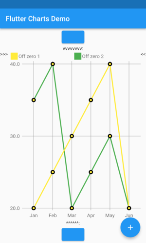
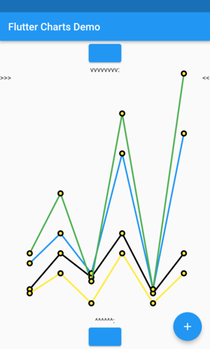
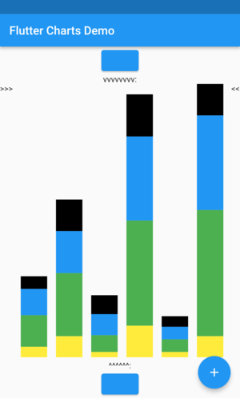
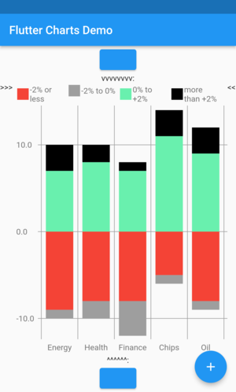
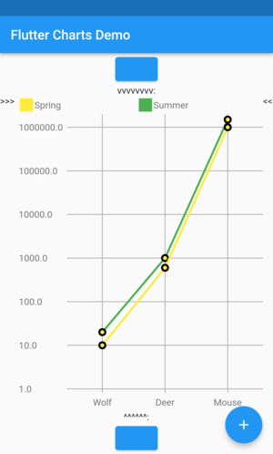

# Table of Contents

1.  [ex10RandomData\_lineChart ](#orgdf330bf)
2.  [ex10RandomData\_verticalBarChart ](#org9869d16)
3.  [ex11RandomDataWithLabelLayoutStrategy\_lineChart ](#orga5ca159)
4.  [ex11RandomDataWithLabelLayoutStrategy\_verticalBarChart ](#org69f485f)
5.  [ex30AnimalsBySeasonWithLabelLayoutStrategy\_lineChart ](#orgf10fae8)
6.  [ex30AnimalsBySeasonWithLabelLayoutStrategy\_verticalBarChart ](#org4e8c2cd)
7.  [ex31SomeNegativeValues\_lineChart ](#orgad37c4b)
8.  [ex31SomeNegativeValues\_verticalBarChart ](#org795317d)
9.  [ex32AllPositiveYsYAxisStartsAbove0\_lineChart ](#org2e225ec)
10. [ex32AllPositiveYsYAxisStartsAbove0\_verticalBarChart ](#orgf30877c)
11. [ex33AllNegativeYsYAxisEndsBelow0\_lineChart ](#orgc6348b9)
12. [ex35AnimalsBySeasonNoLabelsShown\_lineChart ](#orgf9f448f)
13. [ex35AnimalsBySeasonNoLabelsShown\_verticalBarChart ](#orga87259e)
14. [ex40LanguagesWithYOrdinalUserLabelsAndUserColors\_lineChart ](#orgb5c9675)
15. [ex50StocksWithNegativesWithUserColors\_verticalBarChart ](#org68880da)
16. [ex52AnimalsBySeasonLogarithmicScale\_lineChart ](#org467bec5)
17. [ex52AnimalsBySeasonLogarithmicScale\_verticalBarChart ](#org6983db2)
18. [ex900ErrorFixUserDataAllZero\_lineChart ](#orgf174ac7)

Include this in README

<table border="2" cellspacing="0" cellpadding="6" rules="groups" frame="hsides">

<colgroup>
<col  class="org-left" />

<col  class="org-left" />

<col  class="org-left" />

<col  class="org-left" />

<col  class="org-left" />

<col  class="org-left" />

<col  class="org-left" />

<col  class="org-left" />

<col  class="org-left" />

<col  class="org-left" />

<col  class="org-left" />

<col  class="org-left" />

<col  class="org-left" />

<col  class="org-left" />

<col  class="org-left" />

<col  class="org-left" />

<col  class="org-left" />

<col  class="org-left" />
</colgroup>
<tbody>
<tr>
<td class="org-left"></td>
<td class="org-left"></td>
<td class="org-left"></td>
<td class="org-left"></td>
<td class="org-left"></td>
<td class="org-left"></td>
<td class="org-left"></td>
<td class="org-left"></td>
<td class="org-left"></td>
<td class="org-left"></td>
<td class="org-left"></td>
<td class="org-left"></td>
<td class="org-left"></td>
<td class="org-left"></td>
<td class="org-left"></td>
<td class="org-left"></td>
<td class="org-left"></td>
<td class="org-left"></td>
</tr>
</tbody>
</table>

# ex10RandomData\_lineChart 

Code

    Widget chartToRun() {
      LabelLayoutStrategy? xContainerLabelLayoutStrategy;
      ChartData chartData;
      ChartOptions chartOptions = const ChartOptions();
      chartData = RandomChartData.generated(chartOptions: chartOptions);
      var lineChartContainer = LineChartTopContainer(
        chartData: chartData,
        xContainerLabelLayoutStrategy: xContainerLabelLayoutStrategy,
      );
    
      var lineChart = LineChart(
        painter: LineChartPainter(
          lineChartContainer: lineChartContainer,
        ),
      );
      return lineChart;
    }

Result

# ex10RandomData\_verticalBarChart 

Code

    Widget chartToRun() {
      LabelLayoutStrategy? xContainerLabelLayoutStrategy;
      ChartData chartData;
      ChartOptions chartOptions = const ChartOptions();
      chartData = RandomChartData.generated(chartOptions: chartOptions);
      var verticalBarChartContainer = VerticalBarChartTopContainer(
        chartData: chartData,
        xContainerLabelLayoutStrategy: xContainerLabelLayoutStrategy,
      );
    
      var verticalBarChart = VerticalBarChart(
        painter: VerticalBarChartPainter(
          verticalBarChartContainer: verticalBarChartContainer,
        ),
      );
      return verticalBarChart;
    }

Result

# ex11RandomDataWithLabelLayoutStrategy\_lineChart 

Code

    Widget chartToRun() {
      LabelLayoutStrategy? xContainerLabelLayoutStrategy;
      ChartData chartData;
      ChartOptions chartOptions = const ChartOptions();
      xContainerLabelLayoutStrategy = DefaultIterativeLabelLayoutStrategy(
      options: chartOptions,
      );
      chartData = RandomChartData.generated(chartOptions: chartOptions);
      var lineChartContainer = LineChartTopContainer(
        chartData: chartData,
        xContainerLabelLayoutStrategy: xContainerLabelLayoutStrategy,
      );
    
      var lineChart = LineChart(
        painter: LineChartPainter(
          lineChartContainer: lineChartContainer,
        ),
      );
      return lineChart;
    }

Result

# ex11RandomDataWithLabelLayoutStrategy\_verticalBarChart 

Code

    Widget chartToRun() {
      LabelLayoutStrategy? xContainerLabelLayoutStrategy;
      ChartData chartData;
      ChartOptions chartOptions = const ChartOptions();
      xContainerLabelLayoutStrategy = DefaultIterativeLabelLayoutStrategy(
      options: chartOptions,
      );
      chartData = RandomChartData.generated(chartOptions: chartOptions);
      var verticalBarChartContainer = VerticalBarChartTopContainer(
        chartData: chartData,
        xContainerLabelLayoutStrategy: xContainerLabelLayoutStrategy,
      );
    
      var verticalBarChart = VerticalBarChart(
        painter: VerticalBarChartPainter(
          verticalBarChartContainer: verticalBarChartContainer,
        ),
      );
      return verticalBarChart;
    }

Result

# ex30AnimalsBySeasonWithLabelLayoutStrategy\_lineChart 

Code

    Widget chartToRun() {
      LabelLayoutStrategy? xContainerLabelLayoutStrategy;
      ChartData chartData;
      ChartOptions chartOptions = const ChartOptions();
      // Shows explicit use of DefaultIterativeLabelLayoutStrategy with Random values and labels.
      // The xContainerLabelLayoutStrategy, if set to null or not set at all, defaults to DefaultIterativeLabelLayoutStrategy
      // Clients can also create their own LayoutStrategy.
      xContainerLabelLayoutStrategy = DefaultIterativeLabelLayoutStrategy(
      options: chartOptions,
      );
      chartData = ChartData(
      dataRows: const [
      [10.0, 20.0, 5.0, 30.0, 5.0, 20.0],
      [30.0, 60.0, 16.0, 100.0, 12.0, 120.0],
      [25.0, 40.0, 20.0, 80.0, 12.0, 90.0],
      [12.0, 30.0, 18.0, 40.0, 10.0, 30.0],
      ],
      xUserLabels: const ['Wolf', 'Deer', 'Owl', 'Mouse', 'Hawk', 'Vole'],
      dataRowsLegends: const [
      'Spring',
      'Summer',
      'Fall',
      'Winter',
      ],
      chartOptions: chartOptions,
      );
      // chartData.dataRowsDefaultColors(); // if not set, called in constructor
      var lineChartContainer = LineChartTopContainer(
        chartData: chartData,
        xContainerLabelLayoutStrategy: xContainerLabelLayoutStrategy,
      );
    
      var lineChart = LineChart(
        painter: LineChartPainter(
          lineChartContainer: lineChartContainer,
        ),
      );
      return lineChart;
    }

Result

# ex30AnimalsBySeasonWithLabelLayoutStrategy\_verticalBarChart 

Code

    Widget chartToRun() {
      LabelLayoutStrategy? xContainerLabelLayoutStrategy;
      ChartData chartData;
      ChartOptions chartOptions = const ChartOptions();
      // Shows explicit use of DefaultIterativeLabelLayoutStrategy with Random values and labels.
      // The xContainerLabelLayoutStrategy, if set to null or not set at all, defaults to DefaultIterativeLabelLayoutStrategy
      // Clients can also create their own LayoutStrategy.
      xContainerLabelLayoutStrategy = DefaultIterativeLabelLayoutStrategy(
      options: chartOptions,
      );
      chartData = ChartData(
      dataRows: const [
      [10.0, 20.0, 5.0, 30.0, 5.0, 20.0],
      [30.0, 60.0, 16.0, 100.0, 12.0, 120.0],
      [25.0, 40.0, 20.0, 80.0, 12.0, 90.0],
      [12.0, 30.0, 18.0, 40.0, 10.0, 30.0],
      ],
      xUserLabels: const ['Wolf', 'Deer', 'Owl', 'Mouse', 'Hawk', 'Vole'],
      dataRowsLegends: const [
      'Spring',
      'Summer',
      'Fall',
      'Winter',
      ],
      chartOptions: chartOptions,
      );
      // chartData.dataRowsDefaultColors(); // if not set, called in constructor
      var verticalBarChartContainer = VerticalBarChartTopContainer(
        chartData: chartData,
        xContainerLabelLayoutStrategy: xContainerLabelLayoutStrategy,
      );
    
      var verticalBarChart = VerticalBarChart(
        painter: VerticalBarChartPainter(
          verticalBarChartContainer: verticalBarChartContainer,
        ),
      );
      return verticalBarChart;
    }

Result

# ex31SomeNegativeValues\_lineChart 

Code

    Widget chartToRun() {
      LabelLayoutStrategy? xContainerLabelLayoutStrategy;
      ChartData chartData;
      ChartOptions chartOptions = const ChartOptions();
      chartData = ChartData(
      dataRows: const [
      [2000.0, 1800.0, 2200.0, 2300.0, 1700.0, 1800.0],
      [1100.0, 1000.0, 1200.0, 800.0, 700.0, 800.0],
      [0.0, 100.0, -200.0, 150.0, -100.0, -150.0],
      [-800.0, -400.0, -300.0, -400.0, -200.0, -250.0],
      ],
      xUserLabels: const ['Jan', 'Feb', 'Mar', 'Apr', 'May', 'Jun'],
      dataRowsLegends: const [
      'Big Corp',
      'Medium Corp',
      'Print Shop',
      'Bar',
      ],
      chartOptions: chartOptions,
      );
      var lineChartContainer = LineChartTopContainer(
        chartData: chartData,
        xContainerLabelLayoutStrategy: xContainerLabelLayoutStrategy,
      );
    
      var lineChart = LineChart(
        painter: LineChartPainter(
          lineChartContainer: lineChartContainer,
        ),
      );
      return lineChart;
    }

Result

# ex31SomeNegativeValues\_verticalBarChart 

Code

    Widget chartToRun() {
      LabelLayoutStrategy? xContainerLabelLayoutStrategy;
      ChartData chartData;
      ChartOptions chartOptions = const ChartOptions();
      chartData = ChartData(
      dataRows: const [
      [2000.0, 1800.0, 2200.0, 2300.0, 1700.0, 1800.0],
      [1100.0, 1000.0, 1200.0, 800.0, 700.0, 800.0],
      [0.0, 100.0, -200.0, 150.0, -100.0, -150.0],
      [-800.0, -400.0, -300.0, -400.0, -200.0, -250.0],
      ],
      xUserLabels: const ['Jan', 'Feb', 'Mar', 'Apr', 'May', 'Jun'],
      dataRowsLegends: const [
      'Big Corp',
      'Medium Corp',
      'Print Shop',
      'Bar',
      ],
      chartOptions: chartOptions,
      );
      var verticalBarChartContainer = VerticalBarChartTopContainer(
        chartData: chartData,
        xContainerLabelLayoutStrategy: xContainerLabelLayoutStrategy,
      );
    
      var verticalBarChart = VerticalBarChart(
        painter: VerticalBarChartPainter(
          verticalBarChartContainer: verticalBarChartContainer,
        ),
      );
      return verticalBarChart;
    }

Result

# ex32AllPositiveYsYAxisStartsAbove0\_lineChart 

Code

    Widget chartToRun() {
      LabelLayoutStrategy? xContainerLabelLayoutStrategy;
      ChartData chartData;
      ChartOptions chartOptions = const ChartOptions();
      // Set option which will ask to start Y axis at data minimum.
      // Even though startYAxisAtDataMinRequested set to true, will not be granted on bar chart
      chartOptions = const ChartOptions(
      dataContainerOptions: DataContainerOptions(
      startYAxisAtDataMinRequested: true,
      ),
      );
      chartData = ChartData(
      dataRows: const [
      [20.0, 25.0, 30.0, 35.0, 40.0, 20.0],
      [35.0, 40.0, 20.0, 25.0, 30.0, 20.0],
      ],
      xUserLabels: const ['Jan', 'Feb', 'Mar', 'Apr', 'May', 'Jun'],
      dataRowsLegends: const [
      'Off zero 1',
      'Off zero 2',
      ],
      chartOptions: chartOptions,
      );
      var lineChartContainer = LineChartTopContainer(
        chartData: chartData,
        xContainerLabelLayoutStrategy: xContainerLabelLayoutStrategy,
      );
    
      var lineChart = LineChart(
        painter: LineChartPainter(
          lineChartContainer: lineChartContainer,
        ),
      );
      return lineChart;
    }

Result

# ex32AllPositiveYsYAxisStartsAbove0\_verticalBarChart 

Code

    Widget chartToRun() {
      LabelLayoutStrategy? xContainerLabelLayoutStrategy;
      ChartData chartData;
      ChartOptions chartOptions = const ChartOptions();
      // Set option which will ask to start Y axis at data minimum.
      // Even though startYAxisAtDataMinRequested set to true, will not be granted on bar chart
      chartOptions = const ChartOptions(
      dataContainerOptions: DataContainerOptions(
      startYAxisAtDataMinRequested: true,
      ),
      );
      chartData = ChartData(
      dataRows: const [
      [20.0, 25.0, 30.0, 35.0, 40.0, 20.0],
      [35.0, 40.0, 20.0, 25.0, 30.0, 20.0],
      ],
      xUserLabels: const ['Jan', 'Feb', 'Mar', 'Apr', 'May', 'Jun'],
      dataRowsLegends: const [
      'Off zero 1',
      'Off zero 2',
      ],
      chartOptions: chartOptions,
      );
      var verticalBarChartContainer = VerticalBarChartTopContainer(
        chartData: chartData,
        xContainerLabelLayoutStrategy: xContainerLabelLayoutStrategy,
      );
    
      var verticalBarChart = VerticalBarChart(
        painter: VerticalBarChartPainter(
          verticalBarChartContainer: verticalBarChartContainer,
        ),
      );
      return verticalBarChart;
    }

Result

# ex33AllNegativeYsYAxisEndsBelow0\_lineChart 

Code

    Widget chartToRun() {
      LabelLayoutStrategy? xContainerLabelLayoutStrategy;
      ChartData chartData;
      ChartOptions chartOptions = const ChartOptions();
      // Ask to end Y axis at maximum data (as all data negative)
      chartOptions = const ChartOptions(
      dataContainerOptions: DataContainerOptions(
      startYAxisAtDataMinRequested: true,
      ),
      );
      chartData = ChartData(
      dataRows: const [
      [-20.0, -25.0, -30.0, -35.0, -40.0, -20.0],
      [-35.0, -40.0, -20.0, -25.0, -30.0, -20.0],
      ],
      xUserLabels: const ['Jan', 'Feb', 'Mar', 'Apr', 'May', 'Jun'],
      dataRowsLegends: const [
      'Off zero 1',
      'Off zero 2',
      ],
      chartOptions: chartOptions,
      );
      var lineChartContainer = LineChartTopContainer(
        chartData: chartData,
        xContainerLabelLayoutStrategy: xContainerLabelLayoutStrategy,
      );
    
      var lineChart = LineChart(
        painter: LineChartPainter(
          lineChartContainer: lineChartContainer,
        ),
      );
      return lineChart;
    }

Result

# ex35AnimalsBySeasonNoLabelsShown\_lineChart 

Code

    Widget chartToRun() {
      LabelLayoutStrategy? xContainerLabelLayoutStrategy;
      ChartData chartData;
      ChartOptions chartOptions = const ChartOptions();
      // Set chart options to show no labels
      chartOptions = const ChartOptions.noLabels();
    
      chartData = ChartData(
      dataRows: const [
      [10.0, 20.0, 5.0, 30.0, 5.0, 20.0],
      [30.0, 60.0, 16.0, 100.0, 12.0, 120.0],
      [25.0, 40.0, 20.0, 80.0, 12.0, 90.0],
      [12.0, 30.0, 18.0, 40.0, 10.0, 30.0],
      ],
      xUserLabels: const ['Wolf', 'Deer', 'Owl', 'Mouse', 'Hawk', 'Vole'],
      dataRowsLegends: const [
      'Spring',
      'Summer',
      'Fall',
      'Winter',
      ],
      chartOptions: chartOptions,
      );
      var lineChartContainer = LineChartTopContainer(
        chartData: chartData,
        xContainerLabelLayoutStrategy: xContainerLabelLayoutStrategy,
      );
    
      var lineChart = LineChart(
        painter: LineChartPainter(
          lineChartContainer: lineChartContainer,
        ),
      );
      return lineChart;
    }

Result

# ex35AnimalsBySeasonNoLabelsShown\_verticalBarChart 

Code

    Widget chartToRun() {
      LabelLayoutStrategy? xContainerLabelLayoutStrategy;
      ChartData chartData;
      ChartOptions chartOptions = const ChartOptions();
      // Set chart options to show no labels
      chartOptions = const ChartOptions.noLabels();
    
      chartData = ChartData(
      dataRows: const [
      [10.0, 20.0, 5.0, 30.0, 5.0, 20.0],
      [30.0, 60.0, 16.0, 100.0, 12.0, 120.0],
      [25.0, 40.0, 20.0, 80.0, 12.0, 90.0],
      [12.0, 30.0, 18.0, 40.0, 10.0, 30.0],
      ],
      xUserLabels: const ['Wolf', 'Deer', 'Owl', 'Mouse', 'Hawk', 'Vole'],
      dataRowsLegends: const [
      'Spring',
      'Summer',
      'Fall',
      'Winter',
      ],
      chartOptions: chartOptions,
      );
      var verticalBarChartContainer = VerticalBarChartTopContainer(
        chartData: chartData,
        xContainerLabelLayoutStrategy: xContainerLabelLayoutStrategy,
      );
    
      var verticalBarChart = VerticalBarChart(
        painter: VerticalBarChartPainter(
          verticalBarChartContainer: verticalBarChartContainer,
        ),
      );
      return verticalBarChart;
    }

Result

# ex40LanguagesWithYOrdinalUserLabelsAndUserColors\_lineChart 

Code

    Widget chartToRun() {
      LabelLayoutStrategy? xContainerLabelLayoutStrategy;
      ChartData chartData;
      ChartOptions chartOptions = const ChartOptions();
      // User-Provided Data (Y values), User-Provided X Labels, User-Provided Data Rows Legends, User-Provided Y Labels, User-Provided Colors
      // This example shows user defined Y Labels that derive order from data.
      //   When setting Y labels by user, the dataRows value scale
      //   is irrelevant. User can use for example interval <0, 1>,
      //   <0, 10>, or any other, even negative ranges. Here we use <0-10>.
      //   The only thing that matters is  the relative values in the data Rows.
      // Current implementation sets
      //   the minimum of dataRows range (1.0 in this example)
      //     on the level of the first Y Label ("Low" in this example),
      //   and the maximum  of dataRows range (10.0 in this example)
      //     on the level of the last Y Label ("High" in this example).
      chartData = ChartData(
      dataRows: const [
      [9.0, 4.0, 3.0, 9.0],
      [7.0, 6.0, 7.0, 6.0],
      [4.0, 9.0, 6.0, 8.0],
      [3.0, 9.0, 10.0, 1.0],
      ],
      xUserLabels: const ['Speed', 'Readability', 'Level of Novel', 'Usage'],
      dataRowsColors: const [
      Colors.blue,
      Colors.yellow,
      Colors.green,
      Colors.amber,
      ],
      dataRowsLegends: const ['Java', 'Dart', 'Python', 'Newspeak'],
      yUserLabels: const [
      'Low',
      'Medium',
      'High',
      ],
      chartOptions: chartOptions,
      );
    
      var lineChartContainer = LineChartTopContainer(
        chartData: chartData,
        xContainerLabelLayoutStrategy: xContainerLabelLayoutStrategy,
      );
    
      var lineChart = LineChart(
        painter: LineChartPainter(
          lineChartContainer: lineChartContainer,
        ),
      );
      return lineChart;
    }

Result

# ex50StocksWithNegativesWithUserColors\_verticalBarChart 

Code

    Widget chartToRun() {
      LabelLayoutStrategy? xContainerLabelLayoutStrategy;
      ChartData chartData;
      ChartOptions chartOptions = const ChartOptions();
      // User-Provided Data (Y values), User-Provided X Labels, User-Provided Data Rows Legends, Data-Based Y Labels, User-Provided Colors,
      //        This shows a bug where negatives go below X axis.
      // If we want the chart to show User-Provided textual Y labels with
      // In each column, adding it's absolute values should add to same number:
      // todo-11-examples 100 would make more sense, to represent 100% of stocks in each category.
    
      chartData = ChartData(
      // each column should add to same number. everything else is relative. todo-11-examples maybe no need to add to same number.
      dataRows: const [
      [-9.0, -8.0, -8.0, -5.0, -8.0],
      [-1.0, -2.0, -4.0, -1.0, -1.0],
      [7.0, 8.0, 7.0, 11.0, 9.0],
      [3.0, 2.0, 1.0, 3.0, 3.0],
      ],
      xUserLabels: const ['Energy', 'Health', 'Finance', 'Chips', 'Oil'],
      dataRowsLegends: const [
      '-2% or less',
      '-2% to 0%',
      '0% to +2%',
      'more than +2%',
      ],
      dataRowsColors: const [
      Colors.red,
      Colors.grey,
      Colors.greenAccent,
      Colors.black,
      ],
      chartOptions: chartOptions,
      );
      var verticalBarChartContainer = VerticalBarChartTopContainer(
        chartData: chartData,
        xContainerLabelLayoutStrategy: xContainerLabelLayoutStrategy,
      );
    
      var verticalBarChart = VerticalBarChart(
        painter: VerticalBarChartPainter(
          verticalBarChartContainer: verticalBarChartContainer,
        ),
      );
      return verticalBarChart;
    }

Result

# ex52AnimalsBySeasonLogarithmicScale\_lineChart 

Code

    Widget chartToRun() {
      LabelLayoutStrategy? xContainerLabelLayoutStrategy;
      ChartData chartData;
      ChartOptions chartOptions = const ChartOptions();
      chartOptions = const ChartOptions(
      dataContainerOptions: DataContainerOptions(
      yTransform: log10,
      yInverseTransform: inverseLog10,
      ),
      );
      chartData = ChartData(
      dataRows: const [
      [10.0, 600.0, 1000000.0],
      [20.0, 1000.0, 1500000.0],
      ],
      xUserLabels: const ['Wolf', 'Deer', 'Mouse'],
      dataRowsLegends: const [
      'Spring',
      'Summer',
      ],
      chartOptions: chartOptions,
      );
      var lineChartContainer = LineChartTopContainer(
        chartData: chartData,
        xContainerLabelLayoutStrategy: xContainerLabelLayoutStrategy,
      );
    
      var lineChart = LineChart(
        painter: LineChartPainter(
          lineChartContainer: lineChartContainer,
        ),
      );
      return lineChart;
    }

Result

# ex52AnimalsBySeasonLogarithmicScale\_verticalBarChart 

Code

    Widget chartToRun() {
      LabelLayoutStrategy? xContainerLabelLayoutStrategy;
      ChartData chartData;
      ChartOptions chartOptions = const ChartOptions();
      chartOptions = const ChartOptions(
      dataContainerOptions: DataContainerOptions(
      yTransform: log10,
      yInverseTransform: inverseLog10,
      ),
      );
      chartData = ChartData(
      dataRows: const [
      [10.0, 600.0, 1000000.0],
      [20.0, 1000.0, 1500000.0],
      ],
      xUserLabels: const ['Wolf', 'Deer', 'Mouse'],
      dataRowsLegends: const [
      'Spring',
      'Summer',
      ],
      chartOptions: chartOptions,
      );
      var verticalBarChartContainer = VerticalBarChartTopContainer(
        chartData: chartData,
        xContainerLabelLayoutStrategy: xContainerLabelLayoutStrategy,
      );
    
      var verticalBarChart = VerticalBarChart(
        painter: VerticalBarChartPainter(
          verticalBarChartContainer: verticalBarChartContainer,
        ),
      );
      return verticalBarChart;
    }

Result

# ex900ErrorFixUserDataAllZero\_lineChart 

Code

    Widget chartToRun() {
      LabelLayoutStrategy? xContainerLabelLayoutStrategy;
      ChartData chartData;
      ChartOptions chartOptions = const ChartOptions();
    
      /// Currently, setting [ChartDate.dataRows] requires to also set all of
      /// [chartData.xUserLabels], [chartData.dataRowsLegends], [chartData.dataRowsColors]
      // Fix was: Add default legend to ChartData constructor AND fix scaling util_dart.dart scaleValue.
      chartData = ChartData(
      dataRows: const [
      [0.0, 0.0, 0.0],
      ],
      // Note: When ChartData is defined,
      //       ALL OF  xUserLabels,  dataRowsLegends, dataRowsColors
      //       must be set by client
      xUserLabels: const ['Wolf', 'Deer', 'Mouse'],
      dataRowsLegends: const [
      'Row 1',
      ],
      dataRowsColors: const [
      Colors.blue,
      ],
      chartOptions: chartOptions,
      );
      var lineChartContainer = LineChartTopContainer(
        chartData: chartData,
        xContainerLabelLayoutStrategy: xContainerLabelLayoutStrategy,
      );
    
      var lineChart = LineChart(
        painter: LineChartPainter(
          lineChartContainer: lineChartContainer,
        ),
      );
      return lineChart;
    }

Result

